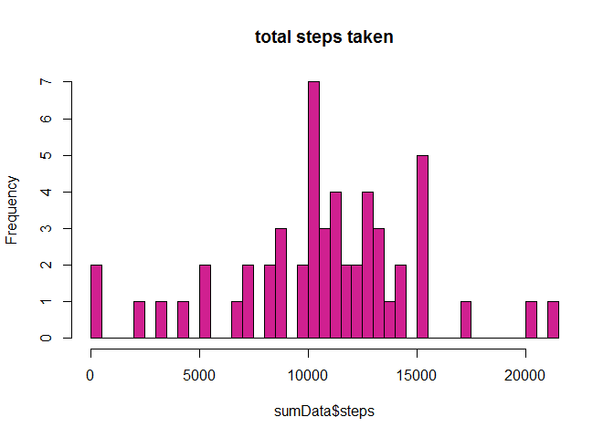
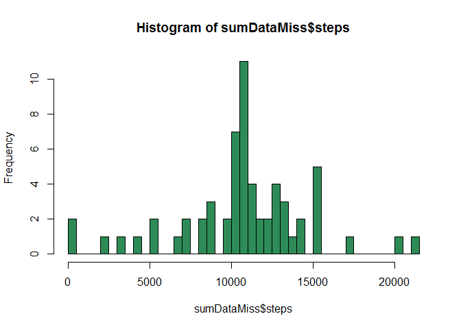
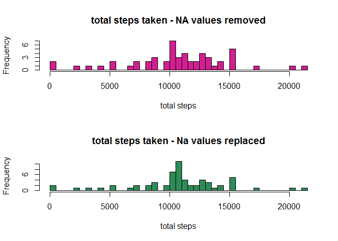
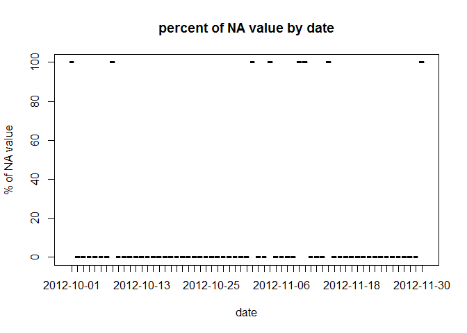

# Reproducible Research: Peer Assessment 1
## Introduction
It is now possible to collect a large amount of data about personal movement using activity monitoring devices such as a Fitbit, Nike Fuelband, or Jawbone Up. These type of devices are part of the "quantified self" movement - a group of enthusiasts who take measurements about themselves regularly to improve their health, to find patterns in their behavior, or because they are tech geeks. But these data remain under-utilized both because the raw data are hard to obtain and there is a lack of statistical methods and software for processing and interpreting the data.

This assignment makes use of data from a personal activity monitoring device. This device collects data at 5 minute intervals through out the day. The data consists of two months of data from an anonymous individual collected during the months of October and November, 2012 and include the number of steps taken in 5 minute intervals each day.

The data for this assignment were downloaded from <https://d396qusza40orc.cloudfront.net/repdata%2Fdata%2Factivity.zip> on 05/04/2016 22:00. Data file is also available in the repository.

The variables included in this dataset are:

* steps: Number of steps taking in a 5-minute interval (missing values are coded as NA)
* date: The date on which the measurement was taken in YYYY-MM-DD format
* interval: Identifier for the 5-minute interval in which measurement was taken

## Loading and preprocessing the data

*load the required library for future plots*

```r
library(ggplot2)
```

first unzipping the file, then reading the data

```r
unzip("activity.zip", files="activity.csv")
actData<- read.csv("activity.csv")
```


## What is mean total number of steps taken per day?
The total number of steps taken per day is calculated below and plotted as an histogram.

```r
sumData<- aggregate(steps ~ date, actData, sum, na.rm=T)
hist(sumData$steps, breaks=50, col="violetred")
```



The mean and median value are:

```r
meanAct<- round(mean(sumData$steps))
medianAct<- round(median(sumData$steps))
print(paste0("mean = ", meanAct, " steps"))
```

```
## [1] "mean = 10766 steps"
```

```r
print(paste0("median = ", medianAct, " steps"))
```

```
## [1] "median = 10765 steps"
```

## What is the average daily activity pattern?
Calculate the average number of steps (averaged across all days) for each 5-minute interval, and make a simple line plot:

```r
intervalData<- aggregate(steps ~ interval, actData, mean, na.rm=T)
plot(intervalData, type="l")
```


and caclutate the interval for which the average number of steps is the highest:

```r
max<- which.max(intervalData$steps)
hourMax<- intervalData$interval[max]
hh<- hourMax%/%100
mm<- hourMax%%100
print(paste0("maximum averaged steps at ",hh,":",mm))
```

```
## [1] "maximum averaged steps at 8:35"
```

## Imputing missing values

The position of missing values in the dataset is stored in `missVal` and the total number of NA is calculated:

```r
missVal<- is.na(actData)
print(sum(missVal))
```

```
## [1] 2304
```

The strategy chosen is to fill missing values with 5-minute interval means (previously calculated and stored in `ìntervalData`). A new dataframe is created (`actDataMiss`) and the missing values are replaced:

```r
actDataMiss<- actData
pos<- which(missVal)
for (i in pos) {
      interv<- actDataMiss$interval[i]
      numRow<- which(intervalData$interval==interv)
      actDataMiss$steps[i]<- intervalData$steps[numRow]
}
```

The incidence of replacing NA value is evaluated by plotting the number of steps taken each day, calculating mean and median values, and comparing them with the value obtained with no NA replacement:

```r
sumDataMiss<- aggregate(steps ~ date, actDataMiss, sum)
hist(sumDataMiss$steps, breaks=50, col="seagreen")
```



The mean and median value are compared:

```r
meanActMiss<- round(mean(sumDataMiss$steps))
medianActMiss<- round(median(sumDataMiss$steps))
comp<- data.frame(row.names = c("removing NA values", "replacing NAs by 5-min interval mean"), c(meanAct, medianAct), c(meanActMiss, medianActMiss))
names(comp)<- c("mean", "median")
print(comp)
```

```
##                                       mean median
## removing NA values                   10766  10766
## replacing NAs by 5-min interval mean 10765  10766
```

The two histograms are compared below:

```r
par(mfrow=c(2,1))
hist(sumData$steps, breaks=50, col="violetred")
hist(sumDataMiss$steps, breaks=50, col="seagreen")
```



The mean and median values obtained are similar without or with replacing NA values by 5-min interval means. The shapes of histogram are also similar. This makes senses because NA values in the dataset are observed for whole days (*see the plot below, where the sum of NA values is plotted as a function of the date*). Thus, by substituting NA values by 5-min means over all days , the same histogram profile is kept. Only the frequency values are increased.


```r
par(mfrow=c(1,1))
NAsum<- aggregate(is.na(steps) ~ date, actData, sum)
plot(NAsum)
```



## Are there differences in activity patterns between weekdays and weekends?
